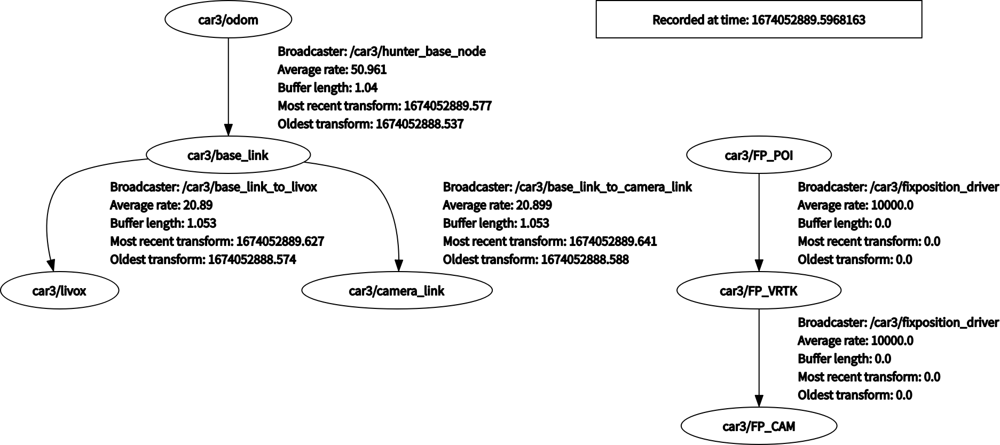
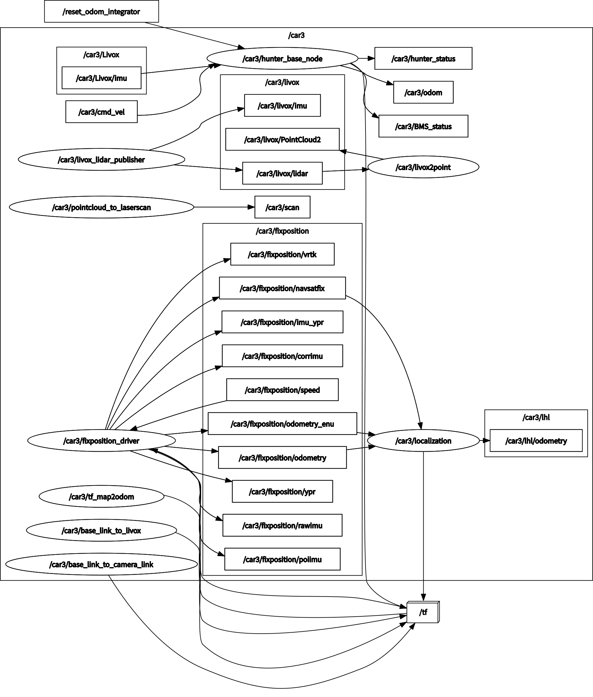

# 安装

- 下载编译

  ```
  cd ~
  mkdir myh_ws
  cd myh_ws
  
  git clone https://github.com/Unmanned-Systems-Lab/ht_real_car_multi.git src
  
  #git clone https://gitee.com/ht-hlf/ht_real_car_multi.git src
  
  catkin_make
  ```

- 修改小车命名空间

  ```
  #在每一个要使用的launch文件(ht_car_multi/launch文件夹里的所有launch文件使用都需要修改)中修改 变量car_name的值为该车对应的值
  #例如：
  gedit ~/myh_ws/src/ht_car_multi/launch/hunter_multi_base.launch
  # 将car100修改成car+小车编号 例如小车编号为03 小车命名空间改为car3
  gedit ~/myh_ws/src/ht_car_multi/launch/hunter_multi_base_laser.launch
  # 将car100修改成car+小车编号 例如小车编号为03 小车命名空间改为car3
  ```

- 增加环境变量

  ```
  gedit ~/.bashrc
  在打开的记事本上 注释掉 source ~/catkin_ws/devel/setup.bash
  加入 source ~/myh_ws/devel/setup.bash
  
  如果要进行单车测试的话，注释掉以下两行（可选）
  export ROS_HOSTNAME={IP}
  export ROS_MASTER+URI={IP}
  测试完需要把这两行注释去掉
  ```

# 使用

- 启动CAN-To-USB 适配器（每次开机后运行一次就行）

  ```
  sudo modprobe gs_usb
  rosrun hunter_bringup bringup_can2usb.bash
  ```

- 只启动多车使用的**底盘节点**

  ```
  roslaunch ht_car_multi hunter_multi_base.launch
  ```


- 启动多车使用的底盘和**固态雷达话题发布**节点

  ```
  roslaunch ht_car_multi hunter_multi_base_laser.launch
  ```

- 启动多车使用的底盘和固态雷达话题发布和**RTK** 节点

  ```
  roslaunch ht_car_multi hunter_multi_base_laser_fixposition.launch
  ```

- 启动多车使用的底盘和固态雷达话题发布和RTK和**主车地图发布**节点

  ```
  roslaunch ht_car_multi hunter_multi_base_laser_fixposition_map_main_car.launch
  ```

- 启动多车使用的底盘和固态雷达话题发布和RTK和**从车定位** 节点

  ```
  roslaunch ht_car_multi hunter_multi_base_laser_fixposition_location_follow_car.launch
  ```


# 备注

- 运行roslaunch ht_car_multi hunter_multi_base_laser_fixposition_map_main_car.launch

  - 

  - 

  - 

    

- 运行roslaunch ht_car_multi hunter_multi_base_laser_fixposition_location_follow_car.launch

  - 
  - 
  - 
